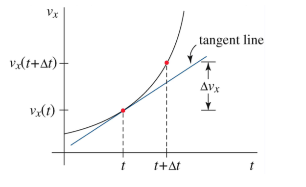

---
output:
  html_document: default
  pdf_document: default
---

# Cinemática unidimênsional

A cinemática é a descrição matemática do movimento. O termo é derivado da palavra grega *kinema*, que significa movimento. Para quantificar o movimento, um sistema de coordenadas matemáticas, chamado de sistema de referência, é usado para descrever espaço e tempo. Uma vez escolhido um sistema de referência, podemos introduzir os conceitos físicos de posição, velocidade e aceleração de forma matematicamente precisa. A Figura 4.1 mostra um Sistema de coordenadas cartesianas em uma dimensão com vetor unitário \(\widehat{i}\) apontando no sentido positivo do eixo das abcissas

<!-- <div class="figure"> -->
<!-- <center> -->
<!--  -->
<!-- <p class="caption">Sistema cartesiano unidimênsional</p> -->
<!-- </center> -->
<!-- </div> -->

```{r img1, fig.cap='Sistema cartesiano unidimênsional', out.width='60%',fig.align='center', echo=FALSE}
knitr::include_graphics("img/1.png")

```


## Posição, intervalo de tempo, deslocamento

### Posição

Considere um objeto movendo-se em uma dimensão. Denotamos a coordenada de posição do centro de massa do objeto em relação à escolha de origem por x (t). A coordenada de posição é uma função do tempo e pode ser positiva, zero ou negativa, dependendo da localização do objeto. A posição tem direção e magnitude, e, portanto, é um vetor,

\[
\vec{x}(t)=x(t)\widehat{i}
\]

Denotamos a posição na origem em \(t=0\) por \(x_0=x(t=0)\). A unidade SI para a posição é o metro \([m]\) 

```{r img2, fig.cap='Vector posição com referência à origem', out.width='40%',fig.align='center', echo=FALSE}


```


### Intervalo de Tempo

Consideremos umintervalo de tempo fechado \([t_1,t_2]\). Caracterizamos este intervalo de tempo pela diferença dos limites desse intervalo tal que,

\[\Delta t=t_2-t_1\]

A unidade SI para os intervalos de tempo é o segundo \([s]\)


### Deslocamento

Um mudança da massa no sistema de coordenadas entre os tempos \(t_1\) e \(t_2\) é tal que

\[\Delta\vec{x}=(x(t_2)-x(t_1))\vec{i}=\Delta x(t)\vec{i}\]


A \(\Delta \vec{x}\) podemos chamar de *deslocamento entre o tempo \(t_1\) e \(t_2\). O deslocamente é uma quantidade vectorial


```{r img3, fig.cap='Deslocamento de um objecto num intervalo de tempo é o vector resultante da diferença entre as posições', out.width='40%',fig.align='center', echo=FALSE}
knitr::include_graphics("img/3.png")

```


## Velocidade

Ao descrever o movimento de objetos, palavras como "rapidez" e "velocidade" são usadas em linguagem comum; No entanto, ao introduzir uma descrição matemática do movimento, precisamos definir estes termos com precisão. O nosso procedimento será definir quantidades médias para intervalos de tempo finitos e depois examinar o que acontece no limite, pois o intervalo de tempo torna-se infinitamente pequeno. Isto leva-nos ao conceito matemático de que a velocidade num instante no tempo é a derivada da posição em relação ao tempo.

### Velocidade média

A componente da velocidade média, \(\overline{v_x}\), para um intervalo de tempo \(\Delta t\) ´é definido como o deslocamento \(\Delta x\) dividido pelo o intervalo de tempo \(\Delta t\),

\[\overline{v_x}=\frac{\Delta x}{\Delta t}\]


A unidade SI para a velocidade é o metro por segundo \([m.s^{-1}]\) 

### Velocidade instantânea


Considere um corpo movendo-se numa direção. Consideremos a coordenada de posição do corpo x(t), com a posição inicial \(x_0\) no tempo \(t = 0\). Consideremos o intervalo de tempo \([t, t + \Delta t]\). A velocidade média para o intervalo é a inclinação da linha que liga os pontos \((t, x (t))\)e \((t, x (t + \Delta t))\). O declive da recta é a mudança de posição sobre a mudança de tempo e é dada por

\[\overline{v_x}=\frac{\Delta x}{\Delta t}=\frac{x(t+ \Delta t)-x(t)}{\Delta t} \]

Vamos ver o que acontece com a velocidade média à medida que reduzimos o tamanho do intervalo de tempo. A inclinação da linha que liga os pontos \((t, x (t))\) e \((t, x (t + \Delta t)\) aproxima-se da inclinação da linha tangente para a curva \(x(t)\) no tempo \(t\).


```{r img4, fig.cap='Gráfico da posição vs. tempo que mostra a linha tangente no tempo $t$', out.width='40%',fig.align='center', echo=FALSE}


```


### Velocidade instantânea

A componente do x da velocida de instantânea no tempo \(t\) é dada pelo declive a reta tangente à curva da posição vs. tmepo no tmepo \(t\)

\[v_x(t)=\lim_{\Delta t \rightarrow0}{\overline{v_x}}=\lim_{\Delta t \rightarrow0}\frac{\Delta x}{\Delta t}= \lim_{\Delta t \rightarrow0} \frac{x(t+\Delta t)-x(t)}{\Delta t}=\frac{dx}{dt}\]

## Aceleração

Devemos aplicar o mesmo procedimento físico e matemático para definir a aceleração, a taxa de mudança de velocidade. Consideremos primeiro como a velocidade instantânea muda ao longo de um intervalo de tempo e, em seguida, calculamos o limite à medida que o intervalo de tempo se aproxima de zero.

### Aceleração média

A aceleração é a quantidade que mede uma mudança de velocidade num determinado intervalo de tempo. Suponhamos que durante um intervalo de tempo \(\Delta t \) um corpo sofre uma mudança de velocidade

\[\Delta \overrightarrow{v}=\overrightarrow{v}(t+\Delta t)-\overrightarrow{v}(t)\]

A mudança na componente do \(x\) da velocidade, \(\Delta v_x\), para o intervalo de tempo \([t,t+\Delta t]\) é então

\[\Delta v_x=v_x(t+\Delta t)-v_x(t)\]

A unidade SI para a aceleração média é o metro por segundo ao quadrado, \([m.s^{-2}]\)

### Aceleração instantânea

Num gráfico da componente \(x\) da velocidade vs. tempo, a aceleração média para um intervalo de tempo \(\Delta t\) é a inclinação da linha reta conectando os dois pontos \((t, v_x (t))\) e \((t +\Delta t, v_x (t +\Delta t))\). Para definir a componente \(x\) da aceleração instantânea no tempo \(t\), empregamos o mesmo argumento do limite que fizemos quando definimos a velocidade instantânea em termos da inclinação da linha tangente.

A componente \(x\) da aceleração instantânea no tmepo \(t\) é o limite do decliveda linnha tangente no instante \(t\) do gráfico da componente \(x\) da velocidade em função do tempo


\[a_x(t)=\lim_{\Delta \rightarrow 0}\overline{a_x}=\lim_{\Delta \rightarrow 0}\frac{(v_x(t+\Delta t)-v_x(t))}{\Delta t}=\lim_{\Delta \rightarrow 0}\frac{\Delta v_x}{\Delta t}=\frac{dv_x}{dt}\]


```{r img5, fig.cap='Gráfico da velocidade vs. tempo que mostra a linha tangente no tempo $t$', out.width='50%',fig.align='center', echo=FALSE}


```


Como a velocidade é a derivada da posição em relação ao tempo, a componente \(x\) da aceleração é a segunda derivada da função de posição, 

\[a_x=\frac{dv_x}{dt}=\frac{d^2x}{dt}\]


