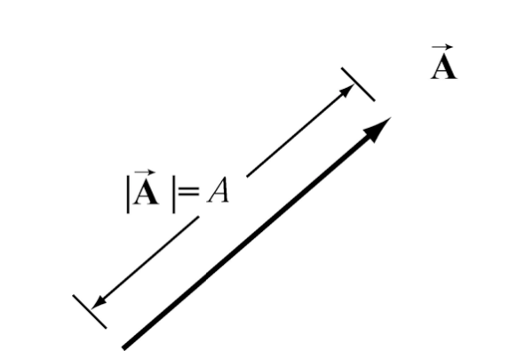

---
output:
  pdf_document: default
  html_document: default
---
# Vectores

## introdução aos vectores

Certas quantidades físicas, como massa ou volume, têm apenas magnitude, ou seja, são representadas por um único valor. Os números que por si só podem representar estas quantidades, com as unidades apropriadas, são chamados de escalares. No entanto, existem outras grandezas físicas que têm magnitude e direcção: a magnitude pode aumentar ou diminuir, e a direção pode ser alterada. Estas quantidades podem ser adicionadas tendo em conta a direcção e a magnitude. A força é um exemplo de uma quantidade que actua numa determinada direcção com um determinada magnitude que se mede em newtons. Quando duas forças actuam sobre um objecto, a soma das forças depende da direção e da magnitude das duas forças. Posição, deslocamento, velocidade, aceleração, força, momento e torque são todas quantidades físicas que podem ser representadas matematicamente por vectores.

## Propriedades dos vectores

Um vector é definido por uma direcção e uma magnitude. Normalmente usa-se o símbolo $\vec{A}$ para representar um vector sendo que a magnitude do vector é $|\vec{A}|\equiv A$. Geometricamente um vector pode ser representado por um seta que aponte para a direcção do vector, sendo o tamanho da seta a magnitude $|\vec{A}|$. 


```{r img6, fig.cap='Representação de um vector', out.width='50%',fig.align='center', echo=FALSE}


```

## Soma de vectores

<!-- ```{r, echo=FALSE, engine='tikz', out.width='90%', fig.ext=if (knitr:::is_latex_output()) 'pdf' else 'png', fig.cap='Some caption.',fig.align='center'} -->
<!-- \begin{center} -->
<!-- \begin{tikzpicture} -->
<!--   \draw[thin,gray!40] (-2,-2) grid (2,2); -->
<!--   \draw[<->] (-2,0)--(2,0) node[right]{$x$}; -->
<!--   \draw[<->] (0,-2)--(0,2) node[above]{$y$}; -->
<!--   \draw[line width=2pt,blue,-stealth](0,0)--(1,1) node[anchor=south west]{$\boldsymbol{u}$}; -->
<!--   \draw[line width=2pt,red,-stealth](0,0)--(-1,-1) node[anchor=north east]{$\boldsymbol{-u}$}; -->
<!-- \end{tikzpicture} -->
<!-- \end{center} -->
<!-- ``` -->

Os vectores podem ser somados. Sejam $\vec{A}$ e $\vec{B}$ dois vectores, podemos definir um terceiro vector por $\vec{C}=\vec{A}+\vec{B}$, onde $\vec{C}$ é o vector resultante da soma entre $\vec{A}$ e $\vec{B}$. Para efectuar esta soma devemos desenhar o vector $\vec{A}$ e colocar a cauda do vector $\vec{B}$ na ponta do vector $\vec{A}$ como mostra a figura \@ref(fig:fig7) (esquerda). A seta que começa no início do $\vec{A}$ e acaba na ponta do $\vec{B}$ é definida como o vector adição $\vec{C}=\vec{A}+\vec{B}$. Outra maneira equivalente de adicionar vectores é colocar o início dos vectores $\vec{A}$ e $\vec{B}$ no mesmo ponto, definindo assim os lados de um paralelogramo. O vector $\vec{C}=\vec{A}+\vec{B}$ será a diagonal desse paralelogramo (figura \@ref(fig:fig7) - direita)


```{r fig7, echo=FALSE, engine='tikz', out.width='90%', fig.ext=if (knitr:::is_latex_output()) 'pdf' else 'png', fig.cap='Soma geométrica de vectores',fig.align='center'}


\begin{minipage}{.2\textwidth}

\begin{tikzpicture}

  \draw[line width=2pt,-stealth](0,0)--(1,3) node[left=55pt,below=20pt]{$\boldsymbol{\vec{C}=\vec{A}+\vec{B}}$};
  \draw[line width=2pt,-stealth](0,0)--(2,1) node[left=20pt,below=10pt]{$\boldsymbol{\vec{B}}$};
  \draw[line width=2pt,-stealth](2,1)--(1,3) node[right=20pt,below=5pt] {$\boldsymbol{\vec{A}}$};
\end{tikzpicture}
\end{minipage}
\hspace{3cm}
\begin{minipage}{.2\textwidth}
\begin{tikzpicture}

  \draw[line width=2pt,-stealth](0,0)--(1,3) node[right=50pt,below=0pt]{$\boldsymbol{\vec{C}=\vec{A}+\vec{B}}$};
  \draw[line width=2pt,-stealth](0,0)--(2,1) node[left=20pt,below=10pt]{$\boldsymbol{\vec{B}}$};
  \draw[line width=2pt,-stealth](0,0)--(-1,2) node[left=20pt,below=5pt] {$\boldsymbol{\vec{A}}$};
  \draw[dashed](-1,2) -- (1,3);
  \draw[dashed](2,1) -- (1,3);
\end{tikzpicture}
\end{minipage}

```


A adição de vectores satisfaz as seguintes propriedades:


- **Comutativa ->** A ordem da adição dos vectores não interessa

$$\vec{B}+\vec{A}=\vec{A}+\vec{B}$$

- **Associativa ->** Quando se adiciona 3 vectores, não interessa a ordem por onde se começa

$$ (\vec{A}+\vec{B})+\vec{C}=\vec{A}+(\vec{B}+\vec{C})$$

- **Elemento identidade na adição de vectores ->** Existe um vector único, $\vec{0}$, que actua como vector identidade para o vector adição. Para todos os vectores $\vec{A}$

$$\vec{A}+\vec{0}=\vec{0}+\vec{A}=\vec{A}$$

- **Elemento inverso para a adição de vectores ->** Para cada vector $\vec{A}$, existe um vector inverso único
$$(-1)\vec{A}\equiv-\vec{A}$$
tal que
$$\vec{A}+(-\vec{A})=\vec{0}$$
O vector $-\vec{A}$ tem a mesma magnitude que $\vec{A}$, $|\vec{A}|=|-\vec{A}|=A$, mas apontam para sentidos opostos (\@ref(fig:fig8)).

```{r fig8, echo=FALSE, engine='tikz', out.width='90%', fig.ext=if (knitr:::is_latex_output()) 'pdf' else 'png', fig.cap='Soma geométrica de vectores',fig.align='center'}


\begin{center}
\begin{tikzpicture}

  \draw[line width=2pt,-stealth](2,0)--(4,2) node[left=30pt,below=0pt]{$\boldsymbol{\vec{A}}$};
 \draw[line width=2pt,-stealth](6,2)--(4,0) node[right=20pt,below=0pt]{$\boldsymbol{-\vec{A}}$};

\end{tikzpicture}
\end{center}

```

## Multiplicação escalar de vectores

Os vectores podem ser multiplicados por números reais. Seja $\vec{A}$ um vector e $c$ um número real positivo, a multiplicação de $\vec{A}$ por $c$ será um novo vector $c\vec{A}$. A magnitude de $c\vec{A}$ será $c$ vezes a magnitude de $\vec{A}$

$$|c\vec{A}|=c|\vec{A}|$$

\begin{equation}
|c\vec{A}|=c|\vec{A}|
(\#eq:escvec)
\end{equation}


