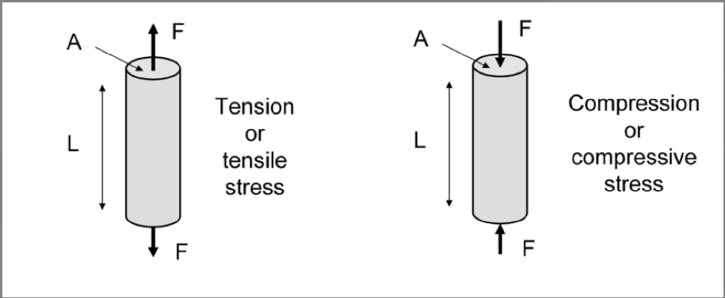
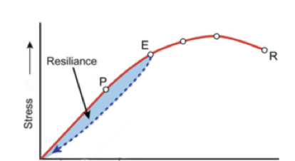

---
output:
  pdf_document: default
  html_document: default
---

# Lei de Hooke

Todos os materiais sólidos exibem um comportamento quando sujeitos a forças de compressão ou tracção. Se a relação entre a força aplicada e a deformação do material for linear, ou seja, se existir uma relação de proporcionalidade directa, diz-se que o material obedece à Lei de Hooke.

**Definição da Lei de Hooke:** Quando um material elástico sofre uma deformação devido a uma força de tracção ou de compressão, desenvolve-se uma força de pressão (força por unidade de área) que é proporcional à deformação relativa, ou alongamento unitário.


```{r img61, fig.cap='Modelo de mola para materiais elásticos (a) relaxado (b) sobre tensão (c) sobre compressão', out.width='50%',fig.align='center', echo=FALSE}


```

Na figura \@ref(fig:img61)  encontra-se um esquema que utiliza a analogia de uma mola elástica. Na posição x0, o material está no seu estado normal, sem sofrer a acção de uma força. Quando é exercida uma força de tracção (tension) o comprimento do material aumenta e passa a ser x. Quando o material sofre uma força de compressão (compression) o seu comprimento também se altera, diminuindo. 
Em termos matemáticos esta relação exprime-se pela formula:

\[ F= -kx\]

onde F é a força aplicada, k é a constante elástica da mola e x é o deslocamento. 
Num sólido, a força aplicada é distribuída pela superficie do sólido sobre a qual a força incide. Existe então uma relação entre a força aplicada e a área da superficie, a qual se designa por stress:

\[\sigma=\frac{F}{A}\]


Esta relação é directamente proporcional à deformação do material, se e só se o material obedecer à lei de Hooke. 
A deformação relativa do material é dada por:

\[\epsilon=\frac{L-L_0}{L_0}\]

em que $L_0$ é o comprimento original no material e $L$ é o comprimento do material sob a acção da força aplicada.
Assim, a relação entre a força aplicada num material e o deslocamento (por compressão ou tracção, figura \@ref(fig:img7) é dado por,

\[\frac{F}{A}=Y\frac{L-L_0}{L_0}\]

onde $Y$ é o módulo elástico, chamado módulo de Young e é uma propriedade característica de cada material, e é dada pela fórmula,


```{r img7, fig.cap='um cilindro de comprimento $L_0$ **(a)** a sofrer uma força de tracção **(b)** a sofrer uma força de 	  compressão.', out.width='50%',fig.align='center', echo=FALSE}


```

O módulo de Young tem unidades de $N/m^2$ ou Pa (Pascal). 
A relação linear entre a força aplicada e o deslocamento no comprimento do material é válida tanto na compressão como na tracção. O gráfico da figura \@ref(fig:img8) mostra a relação entre o stress e a deformação do material. Na fase inicial do gráfico, a relação entre stress e deformação é linear e tem-se uma recta até ao ponto limite de linearidade. Até este ponto diz-se que o material comporta-se como um material de Hooke e a deformação causada pelo stress e totalmente reversível, ou seja, depois e sofrer o stress o material volta ao seu estado original. Entre o ponto de limite de linearidade e o ponto de limite de elástico, o material deixa de se comportar como um material de Hooke porque a relação entre o stress e a deformação deixa de ser linear. 


```{r img8, fig.cap='', out.width='50%',fig.align='center', echo=FALSE}
knitr::include_graphics("img/lei_de_hooke_3.png")

```


Contudo, até ao limite elástico, o material volta ao seu estado original depois de sofrer o stress. Só quando o stress ultrapassa o limite elástico é que o material sofre deformação permanente e nunca mais volta a ter a sua forma original. A partir deste ponto diz-se que o material tem uma deformação permanente ou uma deformação plástica. No gráfico pode-se observar que a fronteira entre a região elástica e a região plástica do material é definida pelo ponto limite elástico.
Como vimos em cima, até ao limite elástico a deformação do material é totalmente reversível, contudo a relação entre stress e deformação não é a mesma quando o material volta ao seu formato original. Esta propriedade chama-se de resiliência. No gráfico da figura \@ref(fig:img9) está representado o efeito de resiliência, que é a área azul. Esta área representa a energia térmica que é dissipada durante o processo de expansão e relaxamento do material.


```{r img9, fig.cap='', out.width='50%',fig.align='center', echo=FALSE}


```

