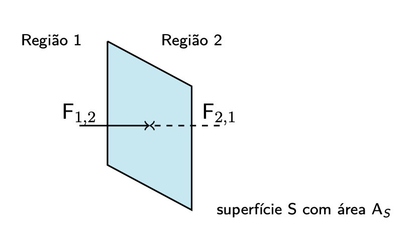
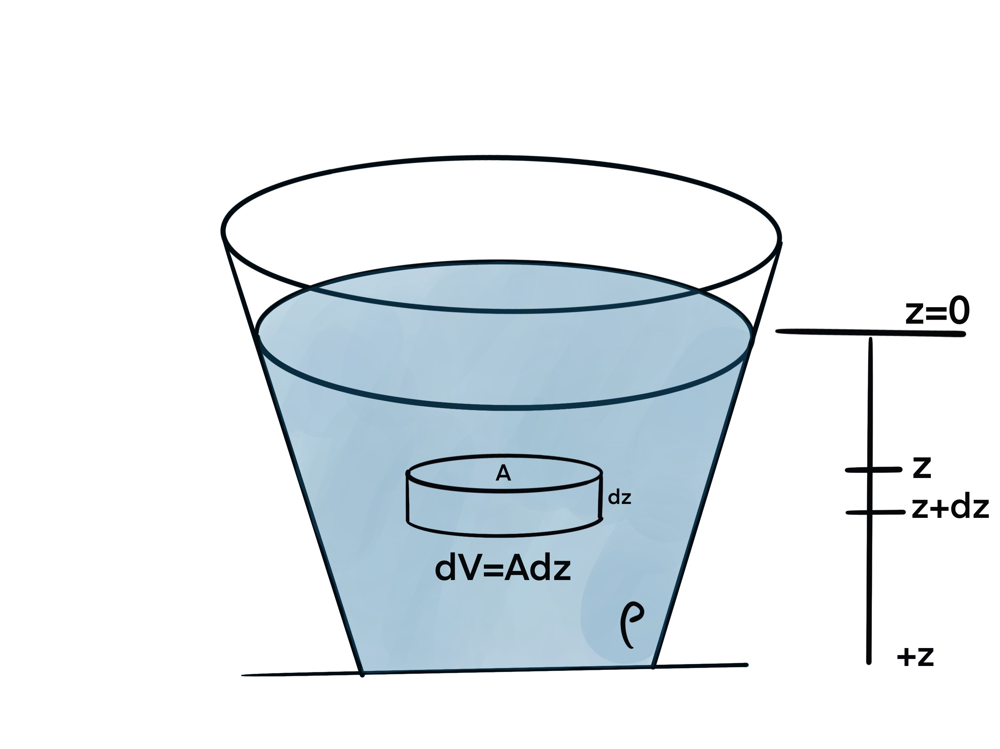
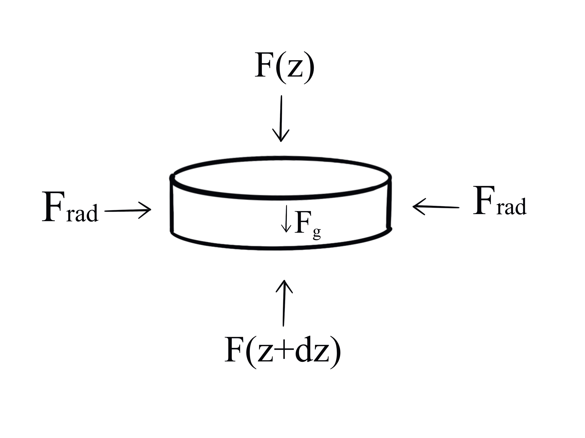

---
output:
  pdf_document: default
  html_document: default
---

# Hidrostática

## Introdução

A água está em toda parte, cobrindo 71% da superfície da Terra. O conteúdo de água de um ser humano pode variar entre 45% e 70% do peso corporal. A água pode existir em três estados da matéria: sólido (gelo), líquido ou gasoso. A água flui através de rios, ribeiras, canais de irrigação e canos, para citar alguns. Os humanos tentaram controlar e aproveitar esse fluxo por meio de muitas tecnologias diferentes, como aquedutos, parafuso de Arquimedes, bombas e turbinas de água. A água no estado gasoso também flui. O vapor de água, mais leve que o ar, pode causar correntes de convecção que formam nuvens. No estado líquido, a densidade das moléculas de água é maior do que no estado gasoso, mas em ambos os estados a água pode fluir. A água líquida forma uma superfície, enquanto o vapor de água não. A água, tanto no estado líquido quanto gasoso, é classificada como fluido para distingui-la do estado sólido. Existe alguma ambiguidade no uso do termo fluido. O gelo flui num glaciar, mas muito lentamente. Portanto, por um curto intervalo de tempo em comparação com o intervalo de tempo envolvido no fluxo, o gelo glacial pode ser considerado um sólido. Na linguagem comum, o termo fluido é usado para descrever o estado líquido da matéria, mas um fluido é qualquer estado da matéria que flui quando há uma tensão de cisalhamento aplicada. A viscosidade de um fluido é uma medida da sua resistência à deformação gradual por tensão de cisalhamento ou tensão de tracção.


## Densidade

A densidade de uma pequena quantidade de matéria é definida pela quantidade de massa $\Delta M$ dividida pelo volume $\Delta V$ desse elemento de matéria,

\begin{equation}
\rho=\frac{\Delta M}{\Delta V}
(\#eq:dens1)
\end{equation}

A unidade SI para a densidade é o kilograma por métro cúbico [$kg/m^3$]. Se a densidade de um material é igual é todos os seus pontos, então a densidade é dada por

\begin{equation}
\rho=\frac{M}{V}
(\#eq:dens2)
\end{equation}

onde $M$ é a massa do material e $V$ é o volume do material. Um material com densidade constante é chamado de material \textit{homogéneo}. Para um material homogéneo, a densidade é uma propriedade intrínseca. Se dividirmos o matrerial é duas partes, a densidade será a mesma para as duas partes,

\begin{equation}
\rho=\rho_1=\rho_2
(\#eq:dens3)
\end{equation}

Contudo a massa e o volume são propriedades \textit{extrínsecas} do material. se dividirmos o material em duas partes, a massa total do material é a soma das massas das partes

\begin{equation}
M=M_1+M_2
(\#eq:dens4)
\end{equation}

tal como o volume

\begin{equation}
V=V_1+V_2
(\#eq:dens5)
\end{equation}

Na seguinte tabela podemos observar os valores da densidade de vários materiais.

```{r results='asis', echo=FALSE}
library(kableExtra)
x=c("Hélio","Ar (ao nível do mar)","Esferovite","Madeira","Etanol","Gelo","Água","Água do mar","Sangue","Alumínio","Ferro","Cobre","Chumbo","Mercúrio","Ouro","Plutónio","Ósmio")
y=c("$0,179$","$1,20$","$75$","$0,7\\times 10^3$","$0.81\\times 10^3$","$0,92\\times 10^3$","$1,0\\times 10^3$","$1,03\\times 10^3$","$1,06\\times 10^3$","$2,7\\times 10^3$","$7,87\\times 10^3$","$8,94\\times 10^3$","$11,34\\times 10^3$","$13,55\\times 10^3$","$19,32\\times 10^3$","$19,84\\times 10^3$","$22,57\\times 10^3$")

tt=cbind(x,y)
tt=as.data.frame(tt)
names(tt)<-c("Material","Densidade, $\\rho$ [$kg/m^3$]")
kable(tt, caption = "Densidade de vários materiais")
```


## Pressão num fluido

Quando uma força de cisalhamento é aplicada à superfície do fluido, o fluido flui. Quando um fluido é estático, a força em qualquer superfície dentro do fluido deve ser perpendicular (normal) a cada lado da superfície. Esta força deve-se às colisões entre as moléculas do fluido de um lado da superfície com as moléculas do outro lado. Para um fluido estático, a soma das forças deve ser zero. Considere uma pequena parte de um fluido estático mostrado na Figura \@ref(fig:imghidros1).

A porção do fluido é dividida em duas partes, que designaremos por 1 e 2, por um pequeno elemento de superfície $S$ de área $A_S$. A força $\vec{F}_{1,2}(S)$ na superfície da região 2, devido ás colisões entre as moléculas de 1 e 2, é perpendicular à superfície.


```{r imghidros1, fig.cap='Forças numa superfície dentro dum fluido', out.width='70%',fig.align='center', echo=FALSE}


```


A força $\vec{F}_{2,1}(S)$ na superfície da região 1 devido às colisões das moléculas de 1 e 2, segundo a 3ª Lei de Newton


\begin{equation}
\vec{F}_{1,2}(S)=-\vec{F}_{2,1}(S)
(\#eq:hidros1)
\end{equation}

Podemos expressar a magnitude das forças que formam esta interacção por

\begin{equation}
F_{\perp}(S)=\mid\vec{F}_{1,2}(S)\mid=\mid\vec{F}_{2,1}(S)\mid
(\#eq:hidros2)
\end{equation}

A pressão, nos pontos da superfície dentro do fluido pode ser definida por

\begin{equation}
P\equiv \frac{F_{\perp}(S)}{A_S}
(\#eq:hidros3)
\end{equation}

A pressão num ponto da superfície $S$ é o limite dado por


\begin{equation}
P=\lim_{A_S \to 0}\frac{F_{\perp}(S)}{A_S}
(\#eq:hidros4)
\end{equation}

A unidade SI para a Pressão é [$N/m^2$] e é chamada de pascal (Pa), onde a pressão atmosférica num ponto é a força por unidade de área exercida numa pequena superfície contendo aquele ponto, pelo peso do ar acima dessa superfície. Na maioria das circunstâncias, a pressão atmosférica é muito próxima da pressão hidrostática causada pelo peso do ar acima do ponto em questão. Para um determinada área de superfície, se esta área tiver uma baixa pressão, significa que tem menos massa atmosférica em cima, enquanto áreas de alta pressão têm mais massa atmosférica em cima. Da mesma forma, quanto mais alto estivermos, menos massa atmosférica haverá acima de nós, de modo que a pressão atmosférica diminui com o aumento da elevação. Em média, uma coluna de ar de um centímetro quadrado de secção transversal, medida do nível do mar ao topo da atmosfera, tem uma massa de cerca de 1,03 kg de peso, cerca de 10,1 N. A atmosfera padrão [$atm$] é uma unidade de pressão tal que

\begin{equation}
1 \hspace{0.1cm}atm = 1,01325 \times 10^5 \hspace{0.1cm} Pa = 1,01325 \hspace{0.1cm}bar
(\#eq:hidros5)
\end{equation}


## Lei de Pascal

Consideremos um fluido estático com densidade uniforme $\rho$. Vamos escolher um sistema de coordenadas tal que o eixo do $z$ tem sentido positivo de cima para baixo e o ponto $z=0$ está situado na superfície do fluido. Vamos escolher um elemento desse fluido com volume cilíndrico infinitesimal a uma profundidade $z$ com uma área de secção $A$ e uma espessura $dz$ como mostra a figura  \@ref(fig:imghidros2). O volume do elemtno é $dV=Adz$ ea massa do fluido contida no elemento é de $dM=\rho Adz$


```{r imghidros2, fig.cap='sistemas de coordenadas para um fluido estático', out.width='70%',fig.align='center', echo=FALSE}


```


A superfície do cilindro infinitesimal tem 3 faces, a face superior, inferior e lateral. Como o fluido está estático, as forças que actuam no cilindro infinitesimal são aplicadas perpendicularmente às faces, no sentido de fora para dentro. A força resultante destas forças é zero. A força que actua na superfície superior é $\vec{F}(z)=F(z)\boldsymbol{\hat{k}}$, no sentido positivo do $z$, onde $F(z)$ e a magnitude da força. Na superfície inferior em $z+dz$ a força é no sentido negativo do $z$, $\vec{F}(z+dz)=-F(z+dz)\boldsymbol{\hat{k}}$, onde $F(z+dz)$ é a magnitude da força. A força gravitacional que acuta no cilindro infinitesimal é dada por $F_g=(dM)g\boldsymbol{\hat{k}}=(\rho dV)g\boldsymbol{\hat{k}}=\rho Adzg\boldsymbol{\hat{k}}$. Existem tamtém forças radiais que cuja sua soma é zero. O diagrama do cilindro infinitesimal pode ser visto na figura  \@ref(fig:imghidros3)


```{r imghidros3, fig.cap='Diagrama de forças no cilindro infinitesimal', out.width='70%',fig.align='center', echo=FALSE}


```


A somo total das forças é zero (segunda Lei de Newton). Então na direcção $+\boldsymbol{\hat{k}}$


\begin{equation}
F(z)-F(z+dz)+\rho Adzg=0
(\#eq:hidros6)
\end{equation}

ao dividir tudo por $A$

\begin{equation}
P(z)-P(z+dz)+\rho dzg=0
(\#eq:hidros7)
\end{equation}

reformulando a equação \@ref(eq:hidros7)


\begin{equation}
\frac{P(z+dz)-P(z)}{dz}=\rho g
(\#eq:hidros8)
\end{equation}

e fazendo o limite da \@ref(eq:hidros8) para $dz\rightarrow 0$,

\begin{equation}
\lim_{dz\rightarrow 0}\frac{P(z+dz)-P(z)}{dz}=\rho g
(\#eq:hidros9)
\end{equation}


resulta numa equação diferencial


\begin{equation}
\frac{dP}{dz}=\rho g
(\#eq:hidros10)
\end{equation}


Podemos, por fim, integrar a \@ref(eq:hidros10)


\begin{equation}
\int^{P(z)}_{P(z=0)}=\int^{z'=z}_{z'=0}\rho g dz'
(\#eq:hidros11)
\end{equation}

O resultado dos integrais da \@ref(eq:hidros11) descreve uma mudança de pressão entre a profundidade $z$ e a superfície do fluido

\begin{equation}
P(z)-P(z=0)=\rho gz
(\#eq:hidros12)
\end{equation}

também conhecida como a $\textbf{Lei de Pascal}$.


