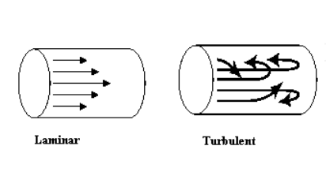
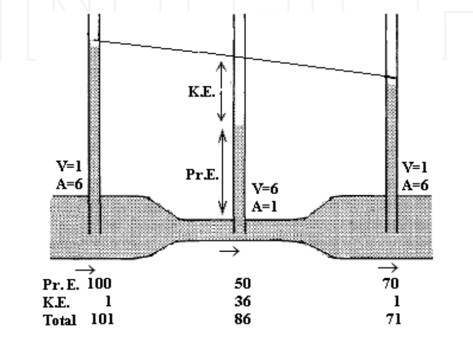
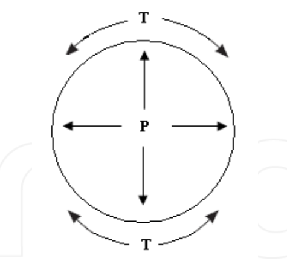
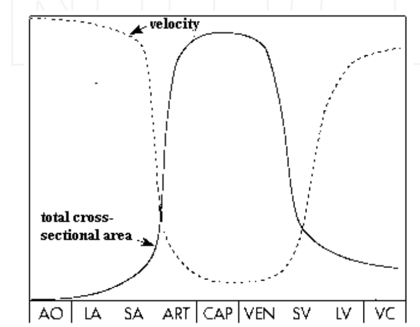
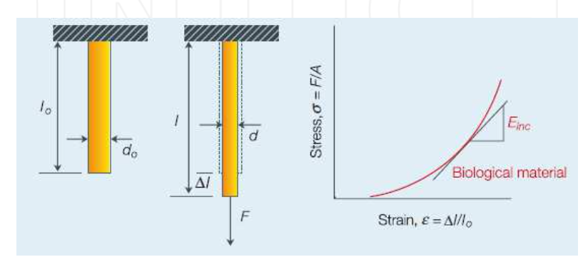
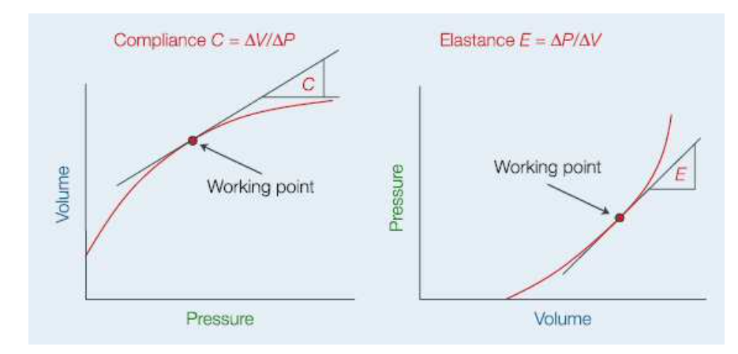
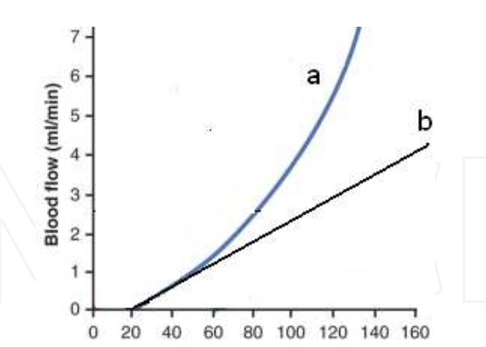
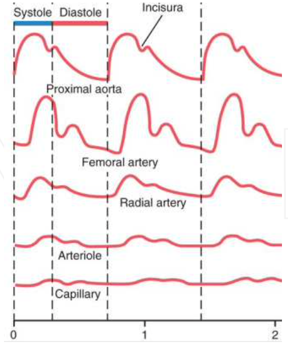

---
output:
  pdf_document: default
  html_document: default
---

# Hemodinâmica

A hemodinâmica é o estudo da relação entre os factores físicos que afectam o fluxo sanguíneo através dos vasos. Neste capítulo, são discutidos esses factores e suas relações.

## O fluxo sanguíneo é uma função da diferença de pressão e resistência

O fluxo sanguíneo (F) através de um vaso sanguíneo é determinado por dois factores principais: **(1)** diferença de pressão ($\Delta$P) entre as duas extremidades do vaso e **(2)** a resistência (R) ao fluxo sanguíneo através do vaso (Fig.\@ref(fig:imghemo1)).

```{r imghemo1, fig.cap='Fluxo do sangue num vaso', out.width='50%',fig.align='center', echo=FALSE}


```

A equação que relaciona estes parâmetros é
\begin{equation}
F=\frac{\Delta P}{R}
(\#eq:darcy)
\end{equation}

Esta equação é chamada de lei de Darcy ou lei de Ohm.

O fluxo (F) é definido como o volume de sangue que passa por cada ponto do vaso numa unidade de tempo. Normalmente, o fluxo sanguíneo é expresso em mililitros por minuto ou litros por minuto, mas também é expresso em mililitros por segundo.

A pressão, que é a força que empurra o sangue através do vaso, é definida como a força exercida numa superfície unitária da parede do tubo perpendicular ao fluxo. A pressão é expressa em milímetros de mercúrio (mmHg). Uma vez que a pressão muda ao longo do curso do vaso sanguíneo, não há uma única pressão a ser usada; portanto, o parâmetro de pressão utilizado é a diferença de pressão ($\Delta P$), também chamada de gradiente de pressão, que é a diferença entre a pressão no início do vaso (P1) e a pressão no final do vaso (P2), ou seja, fluxo de sangue (F) através de um vaso sanguíneo é determinado por dois factores principais: (1) diferença de pressão ($\Delta P$) entre as duas extremidades do vaso e (2) a resistência (R) ao fluxo sanguíneo através do vaso (Fig. \@ref(fig:imghemo1)), ou seja, $\Delta P = P1 - P2$. 

Conforme visto na lei de Darcy, $\Delta P$ é a causa do fluxo; sem diferença de pressão, não haveria fluxo. A energia da pressão é produzida pelo ventrículo e vai caindo ao longo do vaso devido à resistência. Noutras palavras, a resistência é a causa da queda de pressão ao longo de um vaso.
A resistência é o quão difícil é para o sangue fluir do ponto 1 ao ponto 2. A resistência impede o fluxo e é uma medida das interacções entre as partículas que fluem (incluindo moléculas e iões) e as interacções entre as partículas que fluem e a parede do vaso; quanto maior a resistência, menor o fluxo. Se a resistência for $\infty$ (bloqueio completo do vaso) não haverá fluxo. A equação da resistência é: 

\begin{equation}
R=\frac{8}{\pi}\frac{\eta L}{r^4}
(\#eq:resis)
\end{equation}

onde $\eta=$ viscosidade, $L=$ comprimento do vaso e $r=$ raio interior do vaso


A viscosidade representa as interacções entre próprias partículas no fluxo, e o raio representa as interacções entre as partículas no fluxo e a parede do vaso. As unidades de viscosidade são $Pa.s = Ns / m^2$, ou Poise ($dynes.s / cm^2$), com $1 Pa.s = 10$ Poise.

Os glóbulos vermelhos, eritrócitos (hemácias), constituem 99% do volume das partículas em suspensão do sangue. Portanto, a viscosidade do sangue depende da concentração de vários constituintes do plasma e da percentagem do volume dos glóbulos vermelhos (hematócrito), bem como do tamanho, forma e deformabilidade dos eritrócitos. Num indivíduo saudável todos estes parâmetros são constantes, portanto a viscosidade do sangue é constante e a viscosidade não é um meio de controle (regulação) da resistência. Em situações anormais, a viscosidade afecta anormalmente a resistência total. O hematócrito baixo, como na anemia, diminui a viscosidade do sangue. Inversamente, a policitemia aumenta a viscosidade e diminui o fluxo sanguíneo. Na anemia falciforme, os eritrócitos são deformados e inflexíveis, causando graves distúrbios do fluxo sanguíneo regional.
Na equação de resistência, $L$ representa o comprimento do vaso. Como o comprimento dos vasos do corpo é constante, $L$ não poderia ser usado para controlar a resistência.
A resistência tem relação inversa com a 4ª potência de $r$ (raio interno do vaso); como tal, o raio do vaso tem o efeito mais poderoso sobre a resistência, significando que, com pequenas mudanças no raio, a resistência mudará dramaticamente. O raio é o principal factor de controle da resistência do sistema cardiovascular. O raio dos vasos do corpo é controlado pelo sistema simpático.
A resistência está localizada principalmente nas arteríolas. Assumindo um raio aórtico de $15$ mm e um comprimento (arbitrário) de $50$ cm e uma arteríola com um raio de 7,5 $\mu m$ e um comprimento de 1 mm. A proporção do raio é de 2.000 e a proporção do comprimento é de $\sim$ 500, portanto, a proporção de resistência seria $(2.000)^4/500$, ou seja, $\sim 3\times10^{10}$. Isso significa que a resistência de uma única arteríola é $3\times10^{10}$ tão grande quanto a de uma aorta de 50 cm de comprimento. Uma vez que existem $3\times10^8$ arteríolas paralelas, sua resistência total é cerca de $3\times10^{10}/3\times10^8 \cong 100$ vezes maior que a resistência da aorta (Westerhof et al. 2010).


Embora todos os vasos, excepto metarteríolas e capilares, sejam inervados pelo sistema simpático, as arteríolas recebem as inervações mais profundas e desempenham o papel principal no controle da resistência periférica total pelo sistema simpático.
A resistência de qualquer vaso pode ser calculada tendo $\Delta P$ e $F$. Para circulação sistémica, se a pressão aórtica média (P1) for considerada 100 mmHg e a pressão arterial direita média (P2) for 0 mmHg, a diferença de pressão ($\Delta P$) é 100 mmHg. Com um débito cardíaco de 6 l/min (100 ml/s), a resistência total é 100/100 = 1 mmHg/ml/s. Esta unidade é chamada de unidade de resistência periférica (PRU). Outras unidades físicas são utilizadas na clínica e a resistência é expressa em $dyn.s.cm^5$ ou $Pa.s/m^3$. A resistência periférica total da circulação sistémica pode mudar de 4 PRU em constrição muito forte para 0,2 PRU em grande dilatação dos vasos. No sistema pulmonar, a pressão arterial pulmonar média é 16 mmHg e a pressão arterial esquerda média é 2 mmHg, resultando em um $\Delta P$ de 14 mm. Com um débito cardíaco de 100 ml/s, a resistência vascular pulmonar total é de 0,14 PRU, cerca de um sétimo daquela na circulação sistémica.
No corpo, os vasos sanguíneos estão dispostos em série e em paralelo. As artérias, arteríolas, capilares, vénulas e veias são organizadas em série. A resistência total de uma série de vasos é igual à soma das resistências de cada vaso:

\begin{equation}
R_{total}=R_1+R_2+R_3+...
(\#eq:resserie)
\end{equation}

Os vasos sanguíneos ramificam-se extensivamente para formar circuitos paralelos em todos os órgãos e tecidos do corpo. A resistência total dos vasos paralelos é calculada por:

\begin{equation}
\frac{1}{R_{total}}=\frac{1}{R_1}+\frac{1}{R_2}+\frac{1}{R_3}+...
(\#eq:respara)
\end{equation}

Como resultado, adicionar um vaso paralelo a um circuito reduzirá a resistência total. Esta é a razão pela qual a resistência de cada órgão sozinho é muito maior do que a resistência periférica total. Por exemplo, na circulação renal, se a pressão sanguínea na artéria renal for considerada 100 mmHg e a da veia renal for 10 mmHg e o fluxo renal for considerado como 20 ml/s (1200 ml/min), então R = 90/20 = 4,5 PRU, 4,5 vezes mais que a resistência total da circulação sistÉmica.


## Lei de Poisseuille

Na equação $F=\Delta P/R $ substituirmos $R$ pela sua equação, obtemos:

\begin{equation}
F=\frac{\pi \Delta P r^4}{8 \eta L}
(\#eq:pois)
\end{equation}

Esta equação é chamada de lei de Poiseuille. Como se poder observar, o fluxo é proporcional a $\Delta P$, que é a principal causa do fluxo. O fluxo também é proporcional à 4ª potência do raio interno do vaso indicando a grande importância do raio para o fluxo.

## Aplicações fisiológicas e clinicas da lei de Darcy


Na equação $F = \Delta P/R$ se P1 é aumentado, uma vez que $\Delta P = P1 - P2$, $\Delta P$ aumentará o que resulta num aumento no fluxo sanguíneo (F) e ($P_2$). Por exemplo, durante o exercício, a contratilidade do ventrículo esquerdo aumenta e produz mais energia de pressão que resulta no aumento da pressão aórtica ($P_1$), fazendo com que o fluxo sanguíneo para vários órgãos e a pressão capilar ($P_2$) aumentem. Ao contrário, uma diminuição de ($P_1$) resulta numa diminuição do fluxo e da pressão capilar.

Um aumento na ($P_2$) resulta numa diminuição da $\Delta P$ e do fluxo sanguíneo. Por exemplo, se a resistência venosa aumentar ou a pressão arterial ($P_2$) aumentar, como na insuficiência cardíaca, o $\Delta P$ será menor do que o normal e o fluxo sanguíneo diminuirá. Isso subsequentemente resulta num pequeno aumento na pressão arterial ($P_1$). Portanto, uma mudança em qualquer uma das ($P_1$) ou ($P_2$) causa uma mudança semelhante na $P$ correspondente, que é menor do que a primeira. É menor, porque a resistência causa sempre uma queda de pressão entre os dois pontos do vaso. Por exemplo, $\uparrow P_1 \to \uparrow \Delta P(1º) \to \uparrow F \to \uparrow P_2 \to \downarrow \Delta P (2º)$, mas o fluxo é ainda maior, pois devido à resistência, a magnitude do aumento de $P_2$ é menor que o aumento de $P_1$, portanto, a magnitude da segunda mudança (diminuição) de $\Delta P$ é menor do que a primeira mudança (aumento) de $\Delta P$.

Alterar a resistência ajustando o raio dos vasos é o principal mecanismo de controle do fluxo sanguíneo para cada tecido e órgão, denominado controle local do fluxo sanguíneo. É também um dos dois principais mecanismos (controle do coração e resistência) para controlar a pressão arterial.

A equação de Darcy ($F = \Delta P / R$) poderia ser reescrita como: $\Delta P = P1- P2 = FR$. Se $R$ for aumentado diminuindo o raio, outros três parâmetros da equação serão alterados. A primeira coisa que acontece é a redução do fluxo, exactamente como esperado da equação de Darcy. A redução do fluxo causa um acumular de volume de sangue antes da resistência e uma diminuição no volume de sangue após a resistência; assim, $P_1$ aumentará e $P_2$ diminuirá e, subsequentemente, $\Delta P$ ficará maior, exactamente como esperado da 2ª forma da equação de Darcy. O aumento resultante em $\Delta P$ é sempre quantitativamente menor do que o aumento primário de $R$; então, $F$ é sempre menor do que antes. As etapas podem ser resumidas da seguinte forma:


$$R\uparrow \Rightarrow F\downarrow = \Delta P/R \uparrow \Rightarrow P_1\uparrow \& \hspace{0.1cm} P_2 \downarrow \Rightarrow \Delta P \uparrow \Rightarrow F\downarrow = \Delta P \uparrow /R \uparrow$$


Exactamente o oposto acontecerá se $R$ for diminuído. Como já vimos, qualquer mudança em $R$ mudará $P_1$ e $P_2$ em posições opostas. Por exemplo, quando alguém gira a válvula de uma torneira no sentido horário, o raio da saída diminui, o fluxo diminui, a pressão de saída ($P_2$) diminui e a pressão da água pré-válvula ($P_1$) aumenta.
Com base na lei de Darcy, se o sistema cardiovascular for aumentar o fluxo sanguíneo, ele pode aumentar $\Delta P$ aumentando o trabalho cardíaco ou diminuir $R$ diminuindo o fluxo simpático para os vasos, especialmente para as arteríolas, resultando numa diminuição da resistência. Também pode fazer as duas coisas ($\Delta P \uparrow$ e $R\downarrow$). No mecanismo de controle local, apenas a resistência local é ajustada para controlar o fluxo sanguíneo para um tecido. O alto metabolismo de um tecido altera a concentração de alguns factores químicos, incluindo o oxigeno. Esses factores fazem com que as metarteríolas e os esfíncteres pré-capilares se dilatem. Com base na lei de Darcy, o fluxo sanguíneo para o tecido aumenta de modo que o fornecimento de sangue para o tecido seja proporcional ao seu metabolismo.
Quando a pressão arterial está baixa, o barorreflexo estimula o coração aumentando a contratilidade e a frequência cardíaca, o que resulta em $P_1$ mais alto. Barorreflexo também aumenta a resistência periférica total, o que resulta numa maior $P_1$


A resistência causa queda de pressão em todo o sistema vascular (fig. \@ref(fig:imghemo2))). Nas grandes artérias, a resistência é relativamente pequena e a queda de pressão é pequena. As pequenas artérias têm resistência moderada ao fluxo sanguíneo. A resistência é maior nas arteríolas, que às vezes são chamadas de torneiras do sistema vascular. Portanto, a queda de pressão é maior na parte terminal das pequenas artérias e nas arteríolas (fig. \@ref(fig:imghemo2))).

Os vasos de resistência fazem queda de pressão de $\sim$100 a 30 mmHg. Com base na lei de Darcy, a alta resistência desses vasos aumenta a $P_1$ (pressão arterial) e diminui a $P_2$ (pressão capilar). Ambos os efeitos são absolutamente necessários para a sobrevivência. A pressão arterial elevada permite que o sangue chegue a todas as partes do corpo, especialmente à cabeça, que está em um nível mais alto do que o coração. O segundo efeito, pressão capilar baixa, também é muito útil porque evita que os capilares sejam danificados e é necessário para o transporte estável entre os capilares e o fluido intersticial. A alta pressão capilar torna os capilares muito permeáveis para que as proteínas possam atravessar o endotélio, o que resulta em edema.


```{r imghemo2, fig.cap='Queda de pressão em todo o sistema vascular. AP, pressão arterial média; VP, pressão venosa',fig.align='center', echo=FALSE}
knitr::include_graphics("img/hemo_2.png")

```


A anafilaxia é uma condição alérgica em que o débito cardíaco e a pressão arterial diminuem drasticamente. Resulta de uma reacção antígenio-anticorpo depois que um antígenio ao qual a pessoa é sensível entra na circulação, causando a secreção de histamina por basófilos e mastócitos. A histamina dilata as arteríolas, resultando em grande redução da pressão arterial que pode resultar em coma e morte. Drogas vasodilatadoras em excesso também podem produzir efeito semelhante.
Num aneurisma, parte de uma artéria dilata-se anormalmente. Com base na lei de Darcy, o fluxo sanguíneo para a zona perfundida por essa artéria é aumentado ($F \uparrow$), o que resulta em uma pressão mais alta na microcirculação dessa zona ($P_2 \uparrow$), o que pode produzir dor e danos.

Na coarctação da aorta descendente (condição médica na qual a aorta é estreita desde o nascimento), causa estreitamento do lúmen. Como esperado pela lei de Darcy, o fluxo sanguíneo para as partes inferiores do corpo está seriamente diminuído ($F \downarrow$). Como consequência, a pressão arterial na parte inferior da aorta diminui ($P_2 \downarrow$) e na parte superior da aorta pode ser 40-50 por cento maior ($P_1 \uparrow$) do que na aorta inferior. Devido à baixa pressão arterial renal, ocorre retenção de água e sal que vai levar, eventualmente, a pressão arterial da parte inferior do corpo ao normal e produzir hipertensão na parte superior do corpo.

Nas doenças isquêmicas do coração, o estreitamento ou obstrução de uma ou mais artérias coronárias diminui ou cessa o fluxo sanguíneo para as regiões abastecidas pelas artérias afetadas.

Na estenose aórtica, o diâmetro da abertura da válvula aórtica é reduzido significativamente, e a pressão de pulso aórtica (diferença entre a pressão sistólica e diastólica) é reduzida significativamente devido à grande diminuição da pressão sistólica. Com base na lei de Darcy, devido à alta resistência da válvula aórtica, $P_1$ (pressão ventricular) aumenta e $P_2$ (pressão sistólica aórtica) diminui. Isso é exactamente o que vemos na doença. Devido à alta pressão ventricular, pode ocorrer hipertrofia ventricular.

A enxaqueca é um complexo de sintomas de dores de cabeça periódicas, frequentemente com irritabilidade, náuseas, vómitos, prisão de ventre ou diarreia e fotofobia. É precedido por constrição de algumas artérias cranianas, o que resulta em baixo fluxo sanguíneo para as regiões afectadas e, consequentemente, resulta em sintomas prodrómicos, especialmente sintomas oculares. Em seguida, ocorre uma vasodilatação notável dessas artérias cranianas, resultando em hiperperfusão das regiões afectadas, que produz outros sintomas, especialmente dor de cabeça.


## Fluxo laminar e turbulento


O fluxo sanguíneo nos vasos rectos é normalmente laminar. O sangue move-se em suaves camadas concêntricas paralelas. Conforme o fluxo aumenta, o movimento do fluido torna-se ondulado, levando a vórtices em diferentes direções aparentemente aleatórias. Esse movimento irregular do fluido é chamado de turbulência (Fig. \@ref(fig:imghemo3))).


```{r imghemo3, fig.align="center", fig.cap='Fluxo laminar e turbulento',fig.align='center', echo=FALSE}


```

No fluxo turbulento a resistência ao fluxo é maior e energeticamente mais dispendiosa do que o laminar, pois parte da energia mecânica é perdida no movimento errático entre as partículas do fluido. A probabilidade de turbulência está relacionada à densidade do sangue, velocidade, diâmetro do vaso e viscosidade do sangue. Para julgar se um fluxo de fluido é laminar ou turbulento, o número de Reynolds (Re, um parâmetro adimensional: não tem unidade) é frequentemente usado. Re é definido como:


\begin{equation}
R_e=\frac{\rho v D}{\eta}
(\#eq:reynolds)
\end{equation}

onde $\rho$ é a densidade do fluido, $v$ é a velocidade do fluido, $D$ é o raio interno do tubo e $\eta$ é a viscosidade do fluido. O número de Reynolds reflecte o rácio entre a inércia e os efeitos da viscosidade. O número Reynolds crítico é 2200. Para números de Reynolds baixos (<2200), os efeitos viscosos são dominantes e o fluxo é laminar, mas para números de Reynolds altos (> 2200), o fluxo é turbulento. Para números de transição em torno do número Reynolds crítico de 2200, o fluxo não é estritamente laminar nem estritamente turbulento.


Em condições normais de repouso, os fluxos arteriais são laminares. Mas em exercícios pesados, onde o fluxo pode aumentar até cinco vezes, o número de Reynolds pode ficar maior do que o valor crítico e ocorrer turbulência.

O fluxo laminar pode ser perturbado nos pontos de ramificação das artérias, resultando em turbulência que pode depositar as placas ateroscleróticas.

A turbulência ocorre menos na aceleração do fluxo, enquanto que pode ocorrer mais rapidamente na desaceleração dos fluxos. Por exemplo, a turbulência ocorre no ponto distal a uma estenose. As partículas de fluido aceleram através da parte estreita da estenose e desaceleram rapidamente na parte após as estenose, em expansão, resultando em turbulência. A turbulência na estenose grave pode ser iniciada para números de Reynolds tão baixos quanto 50 (Westerhof et al. 2010, p-23). Essa turbulência também alarga o vaso após a estenose. Da mesma forma, a constrição de uma artéria produz turbulência e som. Esta é a razão pela qual os sopros são ouvidos nas artérias contraídas por placas ateroscleróticas e os sons de Korotkoff ouvidos durante a medição da pressão arterial (Barrett et al. 2010, p-540). Na anemia grave, devido à baixa viscosidade, sopros cardíacos funcionais são frequentemente ouvidos. 

## Principio de Bernoulli


Em relação à lei de Darcy, alguns aspectos da hemodinâmica podem parecer estranhos. Por exemplo, a pressão arterial média da aorta é de cerca de 100 mmHg, enquanto é de 180 mmHg nas artérias do pé quando um pessoa está em pé. A pressão arterial muito alta do pé deve-se à força gravitacional, já que uma coluna de sangue com uma altitude de $\sim$130 cm produz uma pressão alta nas artérias do pé. Com base na lei de Darcy, uma vez que a pressão nas artérias do pé é maior do que na aorta, o sangue deveria subir das artérias do pé para a aorta, o que não acontece. Além disso, a pressão arterial nos seios venosos do cérebro é altamente negativa, enquanto a pressão do átrio direito é $\sim$0. Novamente com base na lei de Darcy, o sangue deve se mover para cima, do átrio direito para o sistema venoso do cérebro, o que não é o caso. Esses problemas são resolvidos pelo princípio de Bernoulli. A teoria de Bernoulli afirma que o fluxo entre os pontos A e B depende da diferença de energia mecânica total entre A e B, não apenas da diferença de pressão. A energia mecânica total consiste em energia de pressão, energia potencial e energia cinética. A energia da pressão é igual à pressão $\times$ volume (P $\times$ V). A energia potencial é igual à massa do fluido (m) $\times$ força gravitacional (g) $\times$ altura (h) . a Energia cinética é igual à massa (m) $\times$ velocidade ao quadrado ($v^2$) dividido por 2 ($m\times v^2/2$). Então a

\begin{equation}
Energia \hspace{0.1cm}mecanica\hspace{0.1cm} total = PV + mgh + \frac{1}{2}mv^2
(\#eq:bernoulli)
\end{equation}

Com base nas condições, essas pressões podem ser facilmente convertidas umas nas outras. Por exemplo, considere o modelo apresentado na figura \@ref(fig:imghemo4)). Nesta figura está uma experiência que mostra alguns pontos hidráulicos básicos. Nesta experiência, o fluxo no tubo é constante e é impulsionado pelo gradiente da energia mecânica total. Na primeira parte, a área da secção transversal (A) é 6 e a velocidade (v) é 1. Com base na equação V = F/A (V: velocidade, F: fluxo, A: área da secção transversal), como a área da secção transversal do meio do tubo fica menor, a velocidade aumenta com a mesma proporção.


```{r imghemo4, fig.cap='O fluxo é impulsionado pela diferença total de energia mecânica. No meio do tubo, a área da seção transversal (A) fica menor, resultando num aumento da velocidade (v). Por outras palavras, a energia da pressão é convertida em energia cinética. Na terceira parte do tubo, acontecerá o oposto. (Pr.E., energia da pressão; K.E., energia cinética.)', echo=FALSE}


```


Isto significa que a energia da pressão é convertida em energia cinética. Isto é indicado pelos números na parte inferior da figura e no tubo vertical do meio. Uma vez que existem gradientes mecânicos e de pressão, o fluxo da primeira parte para a segunda parte do tubo é consistente com as equações de Darcy e de Bernoulli. A terceira parte do tubo ao  ficar mais larga, resulta num aumento da energia de pressão e uma diminuição da energia cinética. Aqui, a energia cinética é convertida em energia de pressão. Isso mostra que essas três energias mecânicas podem ser facilmente convertidas uma na outra. O fluxo da parte do meio para a terceira parte não é esperado da lei de Darcy, mas é consistente com o princípio de Bernoulli. Outro ponto importante mostrado nesta experência é que, devido à resistência, a energia mecânica total diminui ao longo do tubo.

Agora podemos explicar os exemplos mencionados acima. Na postura erecta, o sangue aórtico possui muito mais energia potencial gravitacional do que as artérias do pé, de forma que a energia mecânica total na aorta é maior do que nas artérias do pé e faz com que o sangue flua da aorta para o pé.
Quando alguém se deita, a lei de Darcy é suficiente para explicar o fluxo sanguíneo, mas na posição sentada ou em pé, a energia potencial gravitacional é muito grande e a lei de Bernoulli deve ser aplicada para uma explicação mais precisa do fluxo sanguíneo. Por exemplo, na postura erecta, o fluxo sanguíneo para o pulmão não poderia ser bem explicado sem usar o princípio de Bernoulli. Como a pressão nas artérias pulmonares é baixa, a energia potencial gravitacional é comparativamente grande e afecta muito o fluxo sanguíneo pulmonar, de modo que, durante a diástole, o sangue não atinge o ápice do pulmão.


## Lei de Laplace

A lei de Laplace fornece a relação entre a pressão transmural, a tensão da parede, o raio e a espessura da parede em um vaso (Fig. \@ref(fig:imghemo5))) como:


\begin{equation}
T=\frac{P.r}{w}
(\#eq:laplace)
\end{equation}

Onde $T$ é a força por unidade de comprimento tangencial à parede do vaso chamada tensão da parede ($dynes/cm$), $P$ é a pressão transmural, pressão intravascular menos pressão extravascular, em $dynes/cm^2$, $r$ é o raio do vaso em $cm$, e $w$ é espessura do vaso em $cm$. 


```{r imghemo5, fig.align="center", fig.cap='Pressão transmural $P$ e tensão da parede $T$ num vaso', echo=FALSE}


```


Os capilares de paredes finas podem suportar uma alta pressão sanguínea interna, pois embora a espessura da parede seja muito pequena, o  raio também é muito pequeno e sua pressão interna é muito menor do que nas artérias. No aneurisma (alargamento local de uma artéria), como o raio fica maior, a pressão de distensão aumenta e torna o vaso mais vulnerável à ruptura. Na hipertrofia excêntrica, onde um ventrículo se dilata, devido ao aumento do raio, a força de distensão é maior e o ventrículo deve trabalhar mais para bombear o volume sistólico normal isso vai deteriorar ainda mais o ventrículo.

## A velocidade inversamente relacionada com a área da seção transversal

A velocidade ($V$) está relacionada ao fluxo ($F$) e inversamente relacionada à área da seção transversal ($A$) de um vaso da seguinte forma:

\begin{equation}
V=\frac{F}{A}
(\#eq:velo)
\end{equation}

Como os vasos sanguíneos ramificam-se extensivamente da aorta para os capilares, a área de secção transversal de cada vaso diminui, enquanto a área da secção transversal total aumenta.

```{r imghemo6, fig.align="center", fig.cap='Velocidade e área transversal total na circulação sistêmica. Existe a área transversal máxima e velocidade mínima nos capilares. AO, aorta; LA, grandes artérias; SA, pequenas artérias; ART, arteríolas; CAP, capilares; VEN, vênulas; SV, veias pequenas ; LV, veias grandes; VC, veia cava.', echo=FALSE}


```

Os capilares têm a área transversal total máxima, resultando na menor velocidade do sangue (Fig. \@ref(fig:imghemo6)). Essa velocidade baixa fornece tempo suficiente para a troca entre o sangue e o fluido intersticial


## Elasticidade e Complacência


Quando uma barra de um material com área de secção transversal $A$ e comprimento $l_0$ é submetida a uma força ($F$), sofre uma alteração no comprimento de $\Delta l$ (Fig. \@ref(fig:imghemo7)). Para uma barra com uma área de secção transversal maior, a mesma força produzirá uma alteração menor no comprimento. Além disso, se o comprimento inicial ($l_0$) for mais longo, a mesma força causa uma alteração maior no comprimento. Para ter uma caracterização única do material, independente do comprimento e espessura da amostra, a força é normalizada começando na área da secção transversal, $\sigma = F/A$ chamada tensão (ou stress), e o comprimento é normalizado pelo comprimento inicial $\epsilon = \Delta l/ l_0$ chamado deformação. A elasticidade é definida como $E = \sigma / \epsilon$


```{r imghemo7, fig.align="center", fig.cap='Relação tensão-deformação para materiais biológicos', echo=FALSE}


```


Para os vasos ou coração, aumentar o volume sanguíneo resulta num aumento na pressão interna e aumentar a pressão interna resulta num aumento do volume. A pressão é comparável ao stress e o volume é comparável à deformação. Portanto, na fisiologia cardiovascular, a relação pressão-volume (Fig. \@ref(fig:imghemo8)) é normalmente usada em vez da relação stress-deformação. Uma vantagem da relação pressão-volume é que ela pode ser medida $\textit{in vivo}$. É importante notar que a relação pressão-volume não caracteriza o material sozinho, mas inclui a estrutura do órgão como um todo. A mudança de volume por unidade de pressão é chamada complacência ($C = \Delta V / \Delta P$). A mudança de pressão por uma unidade de volume é chamada de elastância ($E = \Delta P / \Delta V$). Para órgãos biológicos como vasos e coração, a relação pressão-volume é uma curva em direcção ao eixo do volume indicando que ao aumentar o volume ou a rigidez, a pressão aumenta (Fig. \@ref(fig:imghemo8)). Portanto, não há uma valor único de complacência ou elastância e para um ponto utiliza-se a tangente da curva pressão-volume. 


```{r imghemo8, fig.align="center", fig.cap='Relação pressão-volume para órgãos biológicos', echo=FALSE}


```

A complacência e a elastância dependem do volume original ($V_0$) do órgão em estudo. Para comparar as propriedades de diferentes vasos sanguíneos, a complacência e a elastância devem ser normalizadas em relação ao volume original do órgão. A complacência normalizada é chamada de distensibilidade [distensibilidade $= C / V_0 = \Delta V / (\Delta P.V_0)$]. A elastância normalizada é chamada de elasticidade de volume [elasticidade de volume $= E.V_0 = (\Delta P.V_0) / \Delta V$].


## Aplicações clínicas e fisiológicas 

A distensibilidade das veias é 8 vezes maior do que as artérias e o volume original das veias é 3 vezes maior do que as artérias, portanto a complacência de cada veia é 24 vezes maior que a sua artéria correspondente (artéria e veia que têm o mesmo fluxo). Isso significa que a perfusão de uma veia, e da sua artéria correspondente, com o mesmo volume de sangue aumenta a pressão da artéria 24 vezes mais que na veia. Portanto, as veias podem armazenar grande quantidade de sangue com pouco aumento de pressão. As veias são chamadas de vasos de capacitância, armazenando 60-70 por cento do volume total de sangue.
A Figura \@ref(fig:imghemo9)) mostra o efeito da pressão sanguínea no fluxo sanguíneo através de um vaso isolado. Conforme esperado pela lei de Darcy ($F = \Delta P/R$), o aumento da pressão resulta num aumento do fluxo, mas, na verdade, o efeito da pressão no fluxo sanguíneo é maior do que o esperado pela lei de Darcy (Fig. \@ref(fig:imghemo9)b), conforme mostrado pela linhas curvas para cima na Figura \@ref(fig:imghemo8)a. Isso porque, devido à distensibilidade vascular, o aumento da pressão arterial não só aumenta a força que empurra o sangue através dos vasos, mas também distende os vasos elásticos, diminuindo a resistência vascular. Portanto, a elasticidade faz com que o coração trabalhe menos para bombear o débito cardíaco normal, resultando numa sobrevida mais longa.


```{r imghemo9, fig.align="center", fig.cap='Efeito da pressão sanguínea no fluxo sanguíneo através de um vaso isolado (a), e calculado a partir da lei de Darcy (b)', echo=FALSE}


```

Na arteriosclerose, os vasos sanguíneos são menos distensíveis, o que resulta numa maior resistência, causando hipertensão, o que resulta num maior trabalho do coração. Estes sintomas têm efeitos graves de deterioração do sistema cardiovascular.

Durante a sístole, devido à distensibilidade vascular, a hipertensão arterial distende as artérias, ou seja, alguma energia da pressão é armazenada nas paredes das artérias como energia potencial. Durante a diástole, a parede das artérias retorna à sua posição diastólica, libertando a energia potencial armazenada para o sangue como energia de pressão. Esta função atenua a pressão sistólica e aumenta a pressão diastólica, resultando numa pressão arterial normal (diferença entre a pressão sistólica e a pressão diastólica) de 40 mmHg. Manter a pressão diastólica razoavelmente alta mantém o sangue fluindo durante a diástole. Na arteriosclerose, devido à rigidez das artérias, menos energia da pressão é armazenada na parede das artérias, fazendo com que a pressão sistólica fique anormalmente alta, resultando numa pressão arterial alta que tem um efeito de deterioração nas artérias.
Outro benefício fisiológico da elasticidade é o amortecimento da pressão arterial nas artérias menores, arteríolas e capilares. A Figura 10 mostra mudanças típicas na pressão arterial conforme o pulso viaja para os vasos periféricos. A intensidade da pulsação torna-se progressivamente menor nas artérias menores e, eventualmente, desaparece nos capilares. Na verdade, somente quando as pulsações aórticas são extremamente grandes ou as arteríolas muito dilatadas é que as pulsações nos capilares podem ser observadas. A falta de pulsação nos capilares garante pressão estável, portanto, permeabilidade estável e transporte estável através da parede dos capilares.

```{r imghemo10, fig.align="center", fig.cap='Atenuação da pressão de arterial nas artérias menores, arteríolas e capilares', echo=FALSE}


```


A causa da diminuição progressiva das pulsações na periferia é dupla: (1) resistência e (2) elasticidade dos vasos. A resistência é a causa da queda de pressão em todos os vasos, diminuindo assim a pressão arterial A elasticidade diminui continuamente a sístole e aumenta a pressão da diástole, aproximando-os um do outro.


